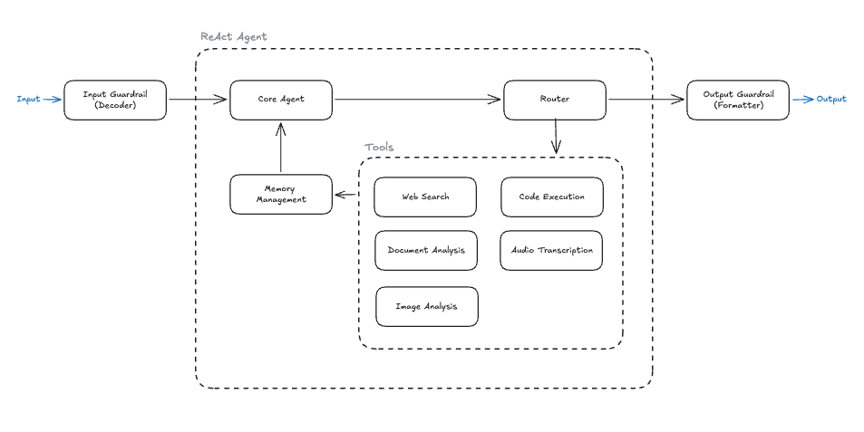

# GAIA Agent

- [Overview](#overview)
  - [Benchmark Comparison](#benchmark-comparison)
  - [Evaluation Metrics](#evaluation-metrics)
- [Technical Details](#technical-details)
  - [Architecture](#architecture)
  - [Tech Stack](#tech-stack)
  - [Key Design Decisions](#key-design-decisions)
- [Upcoming Roadmap](#upcoming-roadmap)
- [Quickstart](#quickstart)

## Overview

An AI agent built to tackle the [GAIA benchmark](https://arxiv.org/abs/2311.12983) (General AI Assistants), an evaluation suite where questions are conceptually simple for humans (~92% accuracy) but operationally complex for AI, requiring multi-step reasoning, web browsing, code execution, and file handling.

> The GAIA benchmark was challenging for AI when it was first released in late 2023. The benchmark has since been saturated (top agents score around 92%). Nevertheless, the benchmark remains a great instructional resource for learning to build AI agents, providing non-trivial challenges even to modern LLMs.

This project serves as a personal learning exercise in building accurate, low-cost, and low-latency AI agents.

Areas of technical focus include memory management, tool design, and agentic architecture. We will leverage existing fit-for-purpose tools, such as Docling for turning messy PDFs into Markdown, instead of attempting to build our own.

### Benchmark Comparison

| Agent (Org)                          | Date    | Level 1 Accuracy | Overall |
| ------------------------------------ | ------- | ---------------- | ------- |
| OPS-Agentic-Search (Alibaba Cloud)   | 2026-03 | 98.9%            | 92.3%   |
| Nemotron-ToolOrchestra-0106 (NVIDIA) | 2026-01 | 96.7%            | 90.3%   |
| **This agent (latest)**              | 2026-04 | 77.4%            | **N/A** |

> Top scores sourced from [https://huggingface.co/spaces/gaia-benchmark/leaderboard](https://huggingface.co/spaces/gaia-benchmark/leaderboard) as of 2026-04-09.

### Evaluation Metrics

| Metric            | Value                |
| ----------------- | -------------------- |
| Questions         | Level 1 (Validation) |
| Accuracy          | 77.4% (41 / 53)      |
| Avg Cost          | $0.61                |
| Avg Latency (s)   | 76                   |
| Avg Input Tokens  | 109519               |
| Avg Output Tokens | 2353                 |
| Avg Turns         | 19.9                 |

## Technical Details

### Architecture



The current architecture is a relatively simple "ReAct agent" with the following components:

#### Core Agent

The core agent performs the following roles:

- reasons about what is currently known and still needs to be learned
- reviews tool output and explicitly summarizes its findings from both the tool output, and from its approach (did what it try work?)
- makes new tool calls
- generates the final answer

#### Tools

Executes tool calls, and appends the entire tool output to the message history (which is fed back to the agent)

Here are the tools we currently support:

- Web Search, via [Tavily](https://tavily.com/).
- Code Execution, via [E2B](https://e2b.dev/). The code is executed in a secure, isolated sandbox that persists for the duration of a given question, allowing the agent to install dependencies and execute code in subsequent tool calls. Also allows the agent to directly execute a Python file from local disk (for situations where a code file is provided)
- Document Parsing, via [Docling](https://docling-project.github.io/docling/). Converts complex PDFs and Excel files into Markdown, preserving layout and structure information.
- Audio Transcription, via [faster-whisper](https://github.com/SYSTRAN/faster-whisper).
- Image Analysis, via [Gemini 3.1 Pro Preview](https://ai.google.dev/gemini-api/docs/models/gemini-3.1-pro-preview), a multimodal LLM. Receives an image and a query to answer.

#### Router

Looks at the agent output and determines the next node to call.

#### Memory Management

Manages the short-term memory, trimming unnecessary information to keep the LLM focused and reduce cost.

Currently, we remove all tool outputs besides the most recent ones, and we prompt the LLM to explicitly summarize its learnings whenever it views the tool outputs. Tool outputs (such as search results from Tavily) are often verbose and have little signal beyond what the LLM learns.

#### Input Guardrail

De-obfuscates the user input. We perform various manipulations, such as reversing the string or base64-decoding it, then select the string with the most common English words as the final user input.

This runs on every call prior to passing the input into an LLM. It does not use an LLM, so it is fast and cheap.

For a production agent, this guardrail could perform operations like refusing suspicious inputs.

#### Output Guardrail

Double-checks the answer from the agent to ensure it meets GAIA formatting standards. We use [GPT-4o mini](https://developers.openai.com/api/docs/models/gpt-4o-mini), a fast affordable LLM, to look at the question and the LLM response and remove any unnecessary words or punctuation.

### Tech Stack

| Layer                             | Technology                                                                                    |
| --------------------------------- | --------------------------------------------------------------------------------------------- |
| **LLM**                           | Claude Opus 4.6                                                                               |
| **Orchestration**                 | [LangGraph](https://github.com/langchain-ai/langgraph)                                        |
| **Web Search**                    | [Tavily](https://tavily.com/)                                                                 |
| **Code Execution**                | [E2B](https://e2b.dev/) (sandboxed Python/JS/Bash)                                            |
| **Document Parsing**              | [Docling](https://docling-project.github.io/docling/)                                         |
| **Audio Transcription**           | [faster-whisper](https://github.com/SYSTRAN/faster-whisper)                                   |
| **Image Analysis**                | [Gemini 3.1 Pro Preview](https://ai.google.dev/gemini-api/docs/models/gemini-3.1-pro-preview) |
| **Output Guardrail (Formatting)** | [GPT-4o mini](https://developers.openai.com/api/docs/models/gpt-4o-mini)                      |
| **Observability**                 | [Langfuse](https://langfuse.com/) (tracing, experiments, metrics)                             |

## Upcoming Roadmap

This project is under active development. Planned work includes:

- **Add prompt caching** - Anthropic requires 4096 tokens to cache the prompt, and we are slightly under at the moment (note this includes the system prompt plus tool definitions). Prompt caching would reduce costs significantly.
- **Use structured outputs in LLM API calls** - This would eliminate a lot of the custom instructions currently in our system prompt.
- **Add integration tests for tools** - We only have unit tests right now, meaning we won't catch certain bugs.
- **Move towards integration tests for the agent graph** - Right now, we are unit testing individual nodes. Integration tests for the agent graph as a whole will allow us to refactor internals without having to update a bunch of tests with every change. If the high-level behavior stays the same, the tests should not need to be updated.
- **Improve tool reliability, tool instructions, and add additional tools**
- **Level 2 and Level 3 support** - Running the agent on Level 2 and Level 3 questions.

_More to come: Need to analyze the results of the most recent run in more detail._

## Quickstart

### 1. Clone and install

```bash
git clone https://github.com/<your-username>/gaia-agent-orchestrator.git
cd gaia-agent-orchestrator
uv sync
```

### 2. Set up environment variables

Copy the example file and fill in your API keys for Anthropic, Tavily, E2B, and Langfuse.

```bash
cp .env.example .env
```

### 3. Run the agent

```bash

# Evaluate on a particular dataset (requires Langfuse)
python evaluate_agent_on_dataset.py
```
