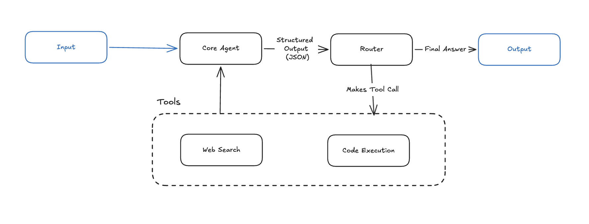

# GAIA Agent

- [Overview](#overview)
  - [Benchmark Comparison](#benchmark-comparison)
  - [Evaluation Metrics](#evaluation-metrics)
- [Technical Details](#technical-details)
  - [Architecture](#architecture)
  - [Tech Stack](#tech-stack)
  - [Key Design Decisions](#key-design-decisions)
- [Upcoming Roadmap](#upcoming-roadmap)
- [Quickstart](#quickstart)

## Overview

An AI agent built to tackle the [GAIA benchmark](https://arxiv.org/abs/2311.12983) (General AI Assistants), an evaluation suite where questions are conceptually simple for humans (~92% accuracy) but operationally complex for AI, requiring multi-step reasoning, web browsing, code execution, and file handling.

> The GAIA benchmark was challenging for AI when it was first released in late 2023. The benchmark has since been saturated (top agents score around 92%). Nevertheless, the benchmark remains a great resource for learning how to build AI agents.

This project serves as a personal learning exercise in building accurate, low-cost, and low-latency AI agents.

Areas of technical focus include memory management, tool design, and agentic architecture. We will leverage existing fit-for-purpose tools, such as Docling for turning messy PDFs into Markdown, instead of attempting to build our own.

### Benchmark Comparison

| Agent (Org)                          | Date    | Level 1 Accuracy | Overall |
| ------------------------------------ | ------- | ---------------- | ------- |
| OPS-Agentic-Search (Alibaba Cloud)   | 2026-03 | 98.9%            | 92.3%   |
| Nemotron-ToolOrchestra-0106 (NVIDIA) | 2026-01 | 96.7%            | 90.3%   |
| **This agent (latest)**              | 2026-04 | **TBD**          | **--**  |

> Top scores sourced from [https://huggingface.co/spaces/gaia-benchmark/leaderboard](https://huggingface.co/spaces/gaia-benchmark/leaderboard) as of 2026-04-09.

### Evaluation Metrics

| Metric            | Value               |
| ----------------- | ------------------- |
| Questions         | 20 (Level 1 subset) |
| Accuracy          | 45%                 |
| Avg Cost          | $0.12               |
| Avg Latency (s)   | TBD                 |
| Avg Output Tokens | TBD                 |
| Avg Turns         | TBD                 |

## Technical Details

### Architecture



The current architecture is a simple "ReAct" loop with the following components:

#### Core Agent

The core agent performs the following roles:

- reasons about what is currently known and still needs to be learned
- reviews tool output
- makes new tool calls
- generates the final answer

#### Tools

Executes tool calls, and appends the entire tool output to the message history (which is fed back to the agent)

#### Router

Looks at the agent output and decides next step.

### Tech Stack

| Layer              | Technology                                                        |
| ------------------ | ----------------------------------------------------------------- |
| **LLM**            | Claude Opus 4.6                                                   |
| **Orchestration**  | [LangGraph](https://github.com/langchain-ai/langgraph)            |
| **Web Search**     | [Tavily](https://tavily.com/)                                     |
| **Code Execution** | [E2B](https://e2b.dev/) (sandboxed Python/JS/Bash)                |
| **Observability**  | [Langfuse](https://langfuse.com/) (tracing, experiments, metrics) |

### Key Design Decisions

- Selection of models and tools.
- Multiple tools, over monolithic tools with complex interfaces.
- (later) Handling context and memory. Subagents.

## Upcoming Roadmap

This project is under active development. Planned work includes:

- **Full Level 1 evaluation** -- Expand from the current 20-question subset to all 53 Level 1 validation questions. This will provide a more statistically meaningful accuracy number and uncover edge cases the current subset doesn't cover.

- **File handling via Docling** -- Add document parsing (PDF, Excel, images) using IBM's [Docling](https://github.com/DS4SD/docling) library. Several Level 1 questions require reading attached spreadsheets or images that the agent currently cannot process. Docling was chosen over Unstructured for its superior table extraction accuracy and LLM-friendly Markdown output.

- **Audio transcription** -- Add speech-to-text capabilities for `.mp3` questions (e.g., via Whisper). Two of the 20 current questions involve audio files that the agent currently flags as "tool not available."

- **Multi-model routing** -- Route different subtasks to specialized models (e.g., a vision model for image questions, a cheaper model for simple formatting). The current single-model approach uses Claude for everything, which is effective but not cost-optimal.

- **Answer verification node** -- Add a "critic" node that reviews the final answer against the original question before outputting, catching logical errors or format issues that slip past the current check. This pattern is common among 70%+ scorers on the GAIA leaderboard.

- **Planning and context management** -- Implement periodic fact-summarization (inspired by approaches like AutoGen's Ledger) to prevent context window bloat on multi-step questions and reduce the agent's tendency to repeat failed strategies.

- **Level 2 and Level 3 support** -- After achieving strong Level 1 results, extend to harder questions requiring 5-10+ steps, multiple tools in sequence, and long-horizon planning.

## Quickstart

### 1. Clone and install

```bash
git clone https://github.com/<your-username>/gaia-agent-orchestrator.git
cd gaia-agent-orchestrator
uv sync
```

### 2. Set up environment variables

Copy the example file and fill in your API keys for Anthropic, Tavily, E2B, and Langfuse.

```bash
cp .env.example .env
```

### 3. Run the agent

```bash

# Evaluate on a particular dataset (requires Langfuse)
python evaluate_agent_on_dataset.py
```
